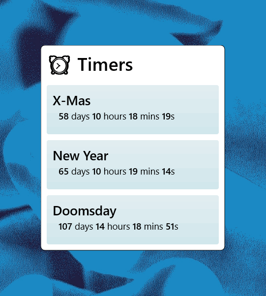

# Before you continue
If you're reading this and wonder how to make the necesary measures for this system, this skin dosen't do any magic and just uses what comes with Rainmeter. As a mini-guide, all you need is a measure that gets the current time, and a measure of the time of that that date.
```ini
; This Measure's `:Timestamp` value will return current time in the numeric Windows timestamp, in one-second increments since 1 January 1601 
[CurrentTime]
Measure=Time

; This measure's `:Timestamp` value will return the numeric Windows timestamp of the date specified, the `TimestampFormat` tries to roughly match the values from `Timestamp` and returns the Windows timestamp of that date; the format I chose is ISO 8601
[TimeTo]
Measure=Time
Timestamp=2024-10-27T00:44:02Z
TimestampFormat=%Y-%m-%dT%H:%M:%SZ

; From here, you can do whatever you want, you just need to subtract `TimeTo` to `CurrentTime` to get the number of seconds between the two dates
; Rainmeter offers a way to convert seconds into a formatted string representing time remaning using the `Uptime` measure, the measure below will return a string formatted like `59d 21h 6m 55s`
[TimeRemaningFormatted]
Measure=Uptime
SecondsValue=([TimeTo:Timestamp]-[CurrentTime:Timestamp])
Format="%4!i!d %3!i!h %2!i!m %1!i!s"
DynamicVariables=1
```

Now onto my skin

# Cowntdowner
A simple skin that shows the time until/since a certain time stamp. You can add and remove Events from the list depending on what you need. You can customize some variables to change the look, scale and Uptime Format.



# Installation
**Get the latest .rmskin from the [Releases](https://github.com/Drgabi18/Cowntdowner/releases) tab**

# Drawbacks
* The skin has no detection system for after the time gets reached, instead it starts looping the time since that event (for some reason, Uptime's `SecondsValue` dose `Abs(x)`, I would have used `IfCondition = #CurrentSection# < 0` if it did to resolve this, I just don't wanna create a separate `Calc` measure for this that's all lol)
* I gave up on the InputText measure getting the correct X and Y while making this, it also dosen't work first click

# Version History
* (27 Octomber 2024) **Release Candidate 1**
  - Initial release

# License
`CC BY-NC-SA 4.0 | Do not republish my work to profit off it`